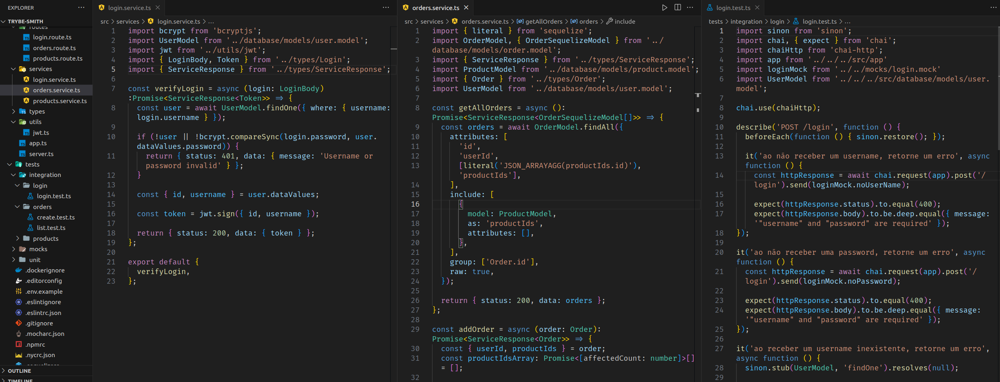

# README: Trybe Smith



## Project Description

For this project, I developed a CRUD (Create, Read, Update and Delete) of medieval items, in the format of an API, using Typescript, I created some endpoints that will read and write to a database, using Sequelize.

### Technologies

- LINUX
- VSCODE
- NODE.JS
- MYSQL
- JAVASCRIPT
- SEQUELIZE
- JSON WEB TOKEN
- BCRYPT
- CHAI
- SINON
- MOCHA

### What I Learned

- How to write integration tests with mocha, chai and sinon
- How to authenticate users with typescript and jwt
- How to encrypt passwords using bcrypt

## How to Run the Project

1. Clone the repository:

   ```bash
   git clone https://github.com/feduarte-dev/trybe-smith
   ```

2. Navigate to the project directory:

   ```bash
   cd your-repository
   ```

3. Initiate the containers

   ```bash
   docker-compose up -d
   docker exec -it trybesmith_api bash
   ```
   
4. Install dependencies inside container:

   ```bash
   npm install
   ```

5. If you want to run migrations and seed:

   ```bash
   npm run db:reset
   ```
5. If you want to run tests or check tests coverage:

   ```bash
   npm run test:local
   npm run test:coverage
   ```

## Contributions

[Felipe](https://www.linkedin.com/in/feduarte-dev/) - /controller - /middlewares - /routes - /services - /types - /utils - /tests

[Trybe](https://www.betrybe.com/) - Everything else
